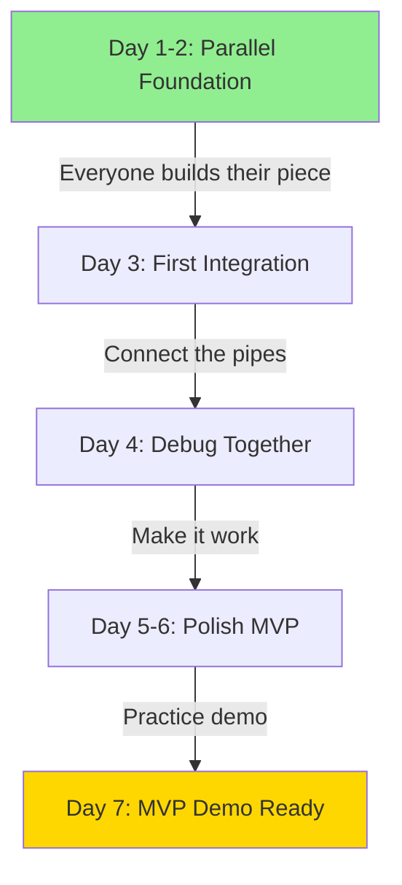

# **ENHANCED INTEGRATION TIMELINE - SIMPLIFIED & MVP-FOCUSED**

NOTE: Parent file is INTEGRATION.md. This is an enhanced version for MVP first approach.

---

## **THREE-PHASE INTEGRATION STRATEGY**

### **PHASE 1: MVP INTEGRATION (Days 1-7)**
**Goal:** Get ONE thing working end-to-end



#### **Day 1-2: Parallel Foundation (NO DEPENDENCIES)**
```yaml
Everyone works independently with AI assistance:

CS1 (Lead):
  - AI Prompt: "Generate Python project structure for SNN"
  - Create shared GitHub repo
  - Set up simple config file
  - Time: 4 hours MAX

CS2 (SNN):
  - AI Prompt: "Create basic SNN with snnTorch for ECG"
  - Get ANY model training on random data
  - Don't optimize yet
  - Time: 6 hours MAX

CS3 (Data):
  - AI Prompt: "Generate 100 synthetic ECG samples"
  - Create simple numpy arrays
  - Normal vs Arrhythmia only
  - Time: 4 hours MAX

CS4 (Deploy):
  - AI Prompt: "Create Flask app with real-time plot"
  - Basic HTML + Plotly.js
  - Mock data is fine initially
  - Time: 4 hours MAX

Bio:
  - Research 2 conditions (Normal, AFib)
  - Define success metrics (Accuracy >80%)
  - Create simple validation function
  - Time: 3 hours MAX
```

#### **Day 3: First Integration (CRITICAL DAY)**
```yaml
Morning Integration (4 hours):
  10:00 AM - Data → Model:
    CS3 gives CS2: sample_data.npy (100 samples)
    CS2 gives CS3: input_requirements.txt
    Test: Model can load and train

  12:00 PM - Model → Deploy:
    CS2 gives CS4: model.pt (trained model)
    CS4 gives CS2: inference_api.py template
    Test: Model can predict

Afternoon Integration (4 hours):
  2:00 PM - End-to-End Test:
    Data → Model → Deployment → Visualization
    Everyone in same room/call
    Fix breaks immediately with AI help

  4:00 PM - Bio Validation:
    Bio validates outputs make medical sense
    Adjust thresholds if needed
```

#### **Day 4-5: Debug & Enhance**
```yaml
Fix What's Broken:
  - Use AI to debug integration issues
  - "Fix this error: [error] in this integration: [code]"
  
Add Core Features:
  - Real-time inference
  - Better visualization
  - Accuracy improvements
  - Energy measurement

Parallel Work Resumes:
  CS2: Improve model accuracy
  CS3: Generate more data
  CS4: Polish visualization
  Bio: Add clinical metrics
```

#### **Day 6-7: MVP Polish**
```yaml
Day 6:
  - Full system test every 2 hours
  - Performance optimization
  - Demo script preparation

Day 7:
  - Demo practice (5 runs minimum)
  - Backup preparations
  - Rest and prepare for presentation
```

---

### **PHASE 2: FEATURE INTEGRATION (Days 8-14)**
**Goal:** Add multiple diseases and signals

```yaml
Week 2 Integration Points:

Day 8: Multi-Disease Checkpoint
  CS3 → CS2: 3 disease types in data
  CS2 → Bio: Model predictions for validation
  Bio → CS4: Clinical dashboard requirements

Day 10: Real-time Checkpoint  
  CS3 → CS4: Streaming data pipeline
  CS2 → CS4: Fast inference model
  CS4 → All: Live demo working

Day 12: Clinical Checkpoint
  Bio → All: Clinical validation complete
  CS2 → Bio: Interpretability features
  CS4 → Bio: Clinical UI implemented

Day 14: Week 2 Demo Ready
  All systems integrated
  5 diseases detectable
  Real-time processing working
```

---

### **PHASE 3: PRODUCTION INTEGRATION (Days 15-30)**
**Goal:** Edge deployment and optimization

```yaml
Week 3-4 Integration (Only if time permits):

Day 16: Edge Deployment Start
Day 18: Optimization Checkpoint  
Day 21: Clinical Trial Simulation
Day 24: Production Testing
Day 27: Final Integration
Day 29: Competition Submission
Day 30: Presentation
```

---

## **SIMPLIFIED DEPENDENCY CHAINS**

### **MVP Critical Path (MUST COMPLETE):**
```
1. CS1: Repo setup (2hr) → ALL: Can start work
2. CS3: Basic data (4hr) → CS2: Can train model  
3. CS2: Trained model (6hr) → CS4: Can deploy
4. CS4: Demo working (8hr) → Bio: Can validate
5. ALL: Integration (Day 3) → MVP Ready (Day 7)
```

### **Enhancement Path (NICE TO HAVE):**
```
- Multi-disease support
- Real-time processing
- Edge deployment
- Clinical dashboard
- Mobile app
```

---

## **🔥 INTEGRATION ANTI-PATTERNS TO AVOID**

### **DON'T DO THIS:**
```yaml
❌ Complex microservices architecture
❌ Multiple database systems
❌ Kubernetes orchestration
❌ Complex CI/CD pipelines
❌ Multi-branch git strategy
❌ Waiting for perfect code before integrating
❌ Building features that don't demo well
```

### **DO THIS INSTEAD:**
```yaml
✅ Monolithic Flask app initially
✅ Simple file-based data storage
✅ Direct function calls
✅ Manual testing initially
✅ Single main branch
✅ Integrate early and often
✅ Build what you can show
```

---

## **AI-POWERED INTEGRATION FIXES**

### **Common Integration Issues & AI Prompts:**

```yaml
Dimension Mismatch:
  "Fix dimension mismatch: model expects [1, 1000] but got [1000, 1]. 
   Modify this code: [code]"

Data Type Issues:
  "Convert numpy array to torch tensor with proper dtype for SNN model: [code]"

API Connection:
  "Connect Flask backend to PyTorch model for real-time inference: [requirements]"

Serialization:
  "Save and load PyTorch SNN model for deployment: [model architecture]"

Performance:
  "Optimize this integration point for <100ms latency: [code]"
```

---

## **DAILY INTEGRATION CHECKLIST**

### **Every Day at 4 PM:**
```yaml
15-Minute Integration Check:
  □ Can data flow through entire pipeline?
  □ Does model produce predictions?
  □ Can deployment show results?
  □ Do metrics make clinical sense?
  □ Is demo working end-to-end?

If any checkbox is NO:
  - STOP feature development
  - FIX integration first
  - Use AI to debug quickly
  - Resume only when working
```

---

## **SUCCESS METRICS BY DAY**

```yaml
Day 1: Environment setup complete (100%)
Day 2: All modules running independently (100%)
Day 3: First successful integration (CRITICAL)
Day 4: End-to-end demo working (80% accuracy)
Day 5: Real-time inference working (<200ms)
Day 6: Clinical metrics integrated (Sens >85%)
Day 7: Polished MVP demo ready

Day 14: Multi-disease detection working
Day 21: Edge deployment functional
Day 30: Production system complete
```

---

## **INTEGRATION RISK MATRIX**

| Risk | Probability | Impact | Mitigation |
|------|------------|--------|------------|
| Data format mismatch | High | High | Define formats Day 1 |
| Model won't converge | Medium | High | Use pretrained backup |
| Deployment crashes | Medium | High | Have cloud backup |
| Integration breaks Day 3 | Low | Critical | All hands on deck |
| Clinical validation fails | Low | Medium | Adjust thresholds |

---

## **EMERGENCY INTEGRATION PROTOCOL**

### **If Integration Fails on Day 3:**
```yaml
EMERGENCY RESPONSE (2-hour fix):
1. Identify exact failure point
2. ALL team members stop other work
3. Create minimal working version:
   - Hardcode data if needed
   - Use dummy model if needed
   - Skip visualization if needed
4. Get SOMETHING working
5. Enhance from there
```

### **Nuclear Option (Day 5):**
```yaml
If still not integrated:
1. CS1 takes over integration
2. Others prepare individual demos
3. Present modules separately
4. Explain integration plan
5. Show what each part does
```

---

## **INTEGRATION TOOLS & SCRIPTS**

### **Quick Integration Test Script:**
```python
# test_integration.py
"""Run every 2 hours to verify integration"""

def test_full_pipeline():
    # Test data generation
    data = generate_synthetic_ecg(100)
    assert data.shape == (100, 1000)
    
    # Test preprocessing
    processed = preprocess_data(data)
    assert processed.max() <= 1.0
    
    # Test model inference
    model = load_model('model.pt')
    predictions = model.predict(processed)
    assert len(predictions) == 100
    
    # Test deployment API
    response = requests.post('http://localhost:5000/predict',
                           json={'data': processed.tolist()})
    assert response.status_code == 200
    
    # Test visualization
    viz_data = prepare_viz_data(predictions)
    assert 'spikes' in viz_data
    
    print("✅ All integration tests passed!")

if __name__ == "__main__":
    test_full_pipeline()
```

---

## **FINAL INTEGRATION WISDOM**

### **The 10 Commandments of Hackathon Integration:**

1. **Integrate Day 3, not Day 29**
2. **Simple and working beats complex and broken**
3. **Every feature must demo well**
4. **Test integration every 4 hours**
5. **Keep interfaces simple (arrays, not objects)**
6. **Document every handoff**
7. **Use AI to fix breaks quickly**
8. **Have backup plans for everything**
9. **Practice the demo 10 times**
10. **When in doubt, simplify**

---

## **MVP INTEGRATION GANTT CHART**

```
Task                Day1  Day2  Day3  Day4  Day5  Day6  Day7
----------------------------------------------------------
Setup Repo          ████
Generate Data       ████  ████
Build SNN Model     ████  ████  
Create Deploy UI    ████  ████
First Integration              ████
Debug & Fix                    ████  ████
Add Features                         ████  ████
Clinical Valid.                      ████  ████  ████
Demo Polish                                      ████  ████
Practice Demo                                           ████
```

---
